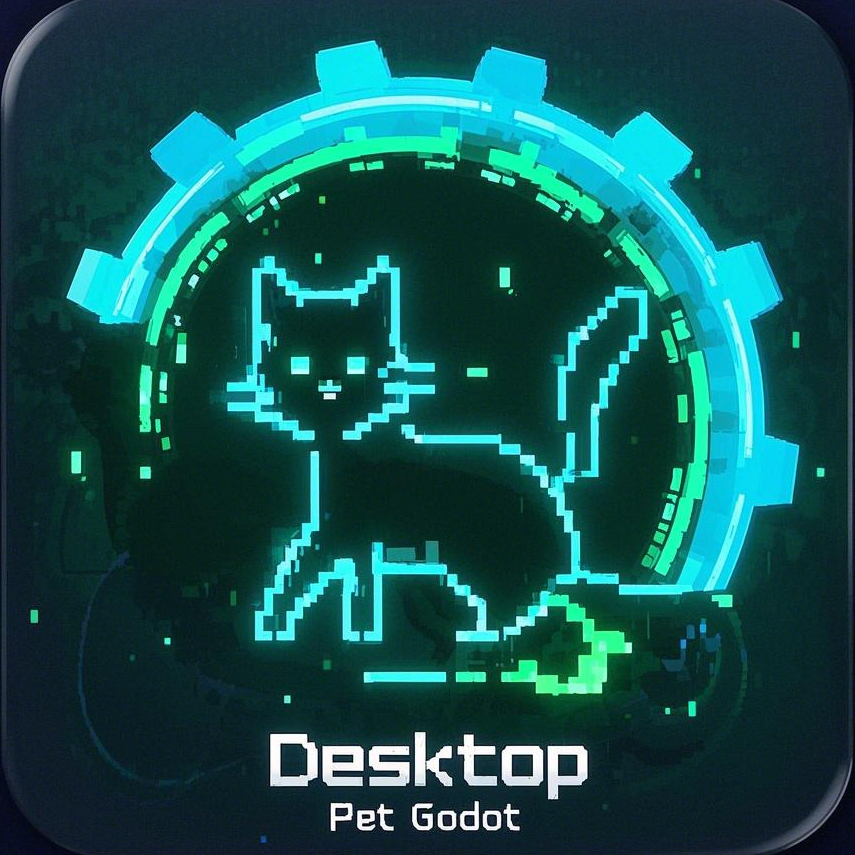
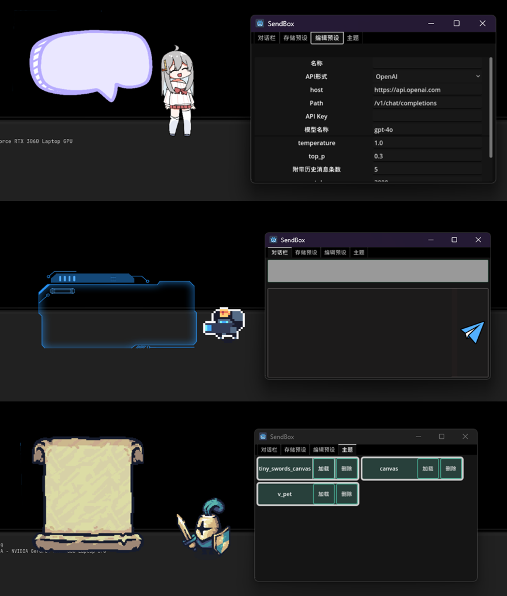

<h1 align="center">🐶 Godog 🐶</h1>
<h2 align="center">AI Godot 桌宠</h2>

<p align="center">
    
</p>

简体中文 / [English](README_EN.md)

## 👋 介绍

🚀 🚀 🚀 一款由大语言模型驱动、Godot 制作的 AI 桌宠，旨在提供一个全能的、丰富的桌面 AI 宠物。你可以将其作为基础，构建你自己独特的桌宠形象和角色行为

- 使用 Godot：轻量、开发简单
- 兼容大量的大语言模型（OpenAI 格式）
- 有预制角色功能，多种形象
- 支持多模态
- 在此基础上，方便构建自己的 AI 桌宠




## 📙 使用手册

[B 站视频介绍](https://www.bilibili.com/video/BV1hBp6eUE91/?vd_source=cd15ef71fe6f4187af03b74e20f12fab)

### ⬇️ 安装

**推荐直接使用最新版本**（老版本可能存在 bug）
下载地址：查看 `release`
下载压缩包`.zip`文件
详细见 [Wiki 教程](https://github.com/jihe520/Desktop-Pet-Godot/wiki)

### 🔑 使用

1. 点击 `编辑预设`，填写名称，API Key，点击 **保存(修改)**
2. 点击 `存储预设`，选中刚刚添加的预设
3. 开始对话

> [!Caution]
> 将主题文件`.pck`都需要放在和`.exe`的同级目录的`themes/*.pck`下面

> [!Caution]
> 当前仅支持 OpenAI 的视觉能力(VISION)，建议使用 **gpt-4o** 模型
> 你可以使用其他模型，但不支持多模态

### ⌨️ 快捷键

- **鼠标右键** 角色区域弹出对话框
- 当焦点在角色窗口上，按 **ESC** 关闭软件

## 🚦 开发计划

- [ ] **优化美术效果**
- [ ] 撰写教程文档
- [ ] 添加多语言的支持
- [ ] 添加更多个性化角色的动画，机制，事件
- [ ] 添加更多模型支持
- [ ] 添加对话框对 markdown 语法渲染的支持
- [ ] 添加语音、文件上传等多模态的能力
- [ ] 添加更多的预设
- [ ] 优化代码架构
- [x] 添加更多角色主题设置，方便导入，通过 mod 载入角色

## 🐶 开发自己的桌宠

[Wiki 教程](https://github.com/jihe520/Desktop-Pet-Godot/wiki)

基于 Godot 的轻便和易学，通过**继承**和 **mod** ，你可以很容易构建独属于你自己的桌面宠物形象。

### 🏗️ 项目架构

```css
- root(Window)
	- Globals(Node)
	- App(Node)
	- Canvas(Node2D) - 角色部分
		- Grapic(Node2D) - 显示区域 和 角色管理
		- Dialogue(Control) - 对话显示
	- Send(Window) - 发送消息
		- TabContainer(TabContainer)
		- 对话栏(Control)
		- 存储预设(Control)
		- 编辑预设(Control)
			- Model(PanelContainer)
			- Parament(PanelContainer)
```

### 🔊 注意

> [!Caution]
>
> 1. 开发使用的 godot 版本号为 4.3 stable，Godot4 应该都是可以的(未测试)
> 2. 导入角色素材记得合适的缩放，同时不忘了调整 显示区域(ClickPolygon) 的大小
> 3. Godot 右上角 选择**兼容模式**

若歧义，以中文版文档为主。
详细见 wiki。

## 🤝 贡献

项目目前处于开发阶段（我有时间就会更新），还存在许多 Bug，我正着手修复。
欢迎任何贡献，即使细微。
添加角色素材等等

## ©️ 版权和授权

你可以使用项目中的任何代码片段，但不能直接将完整项目打包用于商业项目。
同时，需要注意项目中使用到的一些资产的版权信息。

## ❤️ 鸣谢

多亏了如下开源的项目和精彩绝伦的资产，才有了该项目：

- [ChatGPT-stream-for-Godot-4](https://github.com/oceanbuilders/ChatGPT-stream-for-Godot-4) - stream 输出的支持
- [godot-click-through-transparent-window](https://github.com/atadenizoktay/godot-click-through-transparent-window) - 透明窗口
- [tech-dungeon-roguelite](https://trevor-pupkin.itch.io/tech-dungeon-roguelite) - 角色资产
- [tiny-swords](https://pixelfrog-assets.itch.io/tiny-swords) - 角色资产
- [dino-characters](https://arks.itch.io/dino-characters) - 角色资产
- [VPet](https://github.com/LorisYounger/VPet) - 角色资产
